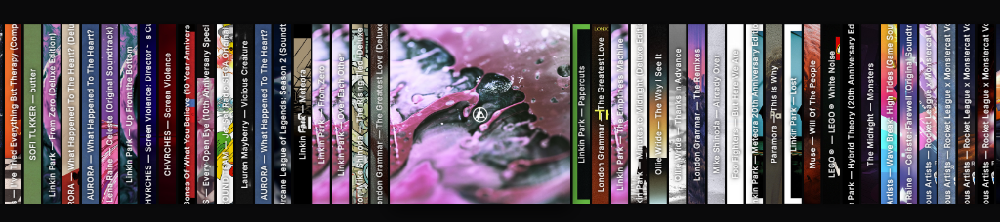
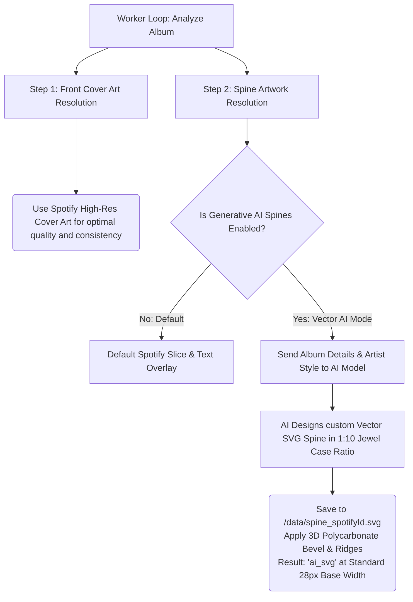

# CD Music Display

> ⚠️ **Disclaimer:** This project was entirely "vibe coded" by an AI agent (Google Antigravity). It is experimental!

> An ultra-wide, touch-first, self-hosted physical CD shelf UI for your Spotify library. Dockerised and designed specifically for long, wide hardware displays like a wall-mounted marquee.


## Features

- 🎵 **Spotify Integration**: Connect your entire Spotify library and control playback via the Spotify Web API.
- 📀 **Physical CD Rack UI**: Browse your albums as a continuous, swipeable rack of physical CD spines.
- 🎛️ **Glassmorphic Controls**: Tap any album to bring it front-and-center. A slick, auto-hiding glass overlay provides play controls and a global mini-player.
- 📱 **Spotify Connect Ready**: Pick which of your physical Spotify Connect devices (Sonos, Echo, Desktop) to play music out of directly from the UI.
- ⚙️ **On-Screen Settings**: A full-screen overlay for changing themes, sort orders, and managing API keys without needing an external app.
- 🖥️ **Ultra-Wide Optimised**: Custom engineered specifically for displays that are very wide but not very tall.
- 🐳 **Docker Deployment**: One-command setup.

## Screenshots



## Quick Start (Docker)

1. Clone the repository:
   ```bash
   git clone https://github.com/Adman1020/CD-Music-Display.git
   cd CD-Music-Display
   ```
2. Start the application using Docker Compose:
   ```bash
   docker compose up -d
   ```
3. Open [http://localhost:3000](http://localhost:3000) in your browser.
4. Follow the on-screen setup wizard to configure your Spotify credentials and log in.

## Spotify Developer Setup

Because this app acts as a remote control for your Spotify account, you must create a personal Spotify Developer App.

1. Go to the [Spotify Developer Dashboard](https://developer.spotify.com/dashboard) and log in.
2. Click on **Create app**.
3. Set your App name and App description to whatever you like.
4. Add the following **Redirect URI**: `http://127.0.0.1:3000/auth/callback` (or `http://localhost:3000/auth/callback` if testing locally, or your specific IP address if accessing over the network).
5. Ensure you check **Web API** and **Web Playback SDK** in the APIs/Permissions section.
6. Copy your **Client ID** and **Client Secret** and enter them into the app's setup screen in your browser.
7. **Note:** A Spotify Premium account is required for full playback control and Connect features.

## Architecture

- **Backend:** Express.js (Node.js) serving a REST API and managing Spotify OAuth securely.
- **Frontend:** Vanilla JavaScript, HTML5, and CSS3. Zero heavy frameworks.
- **Database:** SQLite (via `better-sqlite3`) to securely store your configuration, access tokens, and cached album art.
- **APIs:** Spotify Web API, Cover Art Archive, MusicBrainz, + AI Vision models (optional)

## Artwork Engine & Generative Vector Spines

To recreate the realism of a physical CD rack without relying on inconsistent crowdsourced photos or messy web archives, the background worker server features a **Generative Vector SVG Engine** that algorithmically designs custom high-resolution spines for your library.

### Pipeline Workflow Diagram



### Key Technical Details

#### 1. Generative Vector (SVG) CD Spines
* Why avoid diffusion image generators (DALL-E 3, Imagen 3)? Diffusion models are expensive (~$0.04 to $0.08 per image) and notoriously struggle with vertical spelling and typography on skinny CD spines.
* By prompting lightweight AI LLMs (Gemini, GPT, Claude) to output crisp **raw vector SVG markup**, we obtain **infinite resolution**, perfect typography, customized color palettes matching the album style, and over **99% lower cost** (<$0.0003 per album)!
* All generated spines adhere strictly to a standard single jewel-case aspect ratio ($28\text{px} \times 300\text{px}$, a ~1:10 geometry), eliminating awkward needle-thin or overly distorted cases.

#### 2. Life-Size Shelf Zoom & Scaling
* Want your virtual CDs to match actual physical discs on your display? Use the new **Shelf Scale & Zoom** slider inside UI Settings!
* Dynamically scale the rack height from **Compact (300px)** up to **Desktop (460px)** and all the way to **Life-Size CD (700px)**.
* Spine widths, cover art dimensions, gaps, and momentum scroll mechanics automatically scale in real time without blurry rendering thanks to the vector SVG artwork.

#### 3. 3D Polycarbonate Acrylic Jewel-Case Polish
* Regardless of whether an album uses a custom AI vector spine or the default Spotify slice, the frontend styling applies realistic 3D optical acrylic effects via CSS.
* Features simulated clear polycarbonate refraction gradients, edge shadows, and tactile top/bottom grip grooves/ridges just like a real CD jewel case.

---

## Low-Cost Generative AI Model Recommendations

When enabling Generative AI Spines in Settings, we strongly advise using cost-effective "mini" or "flash" language models that excel at structured coding and SVG generation:

1. **Google Gemini**
   - **`gemini-2.5-flash`** *(Recommended)*: The ultimate balance of high speed, near-zero cost, and exceptional graphic design & SVG coding accuracy. Generous daily free tier allowances on Google AI Studio.
   - **`gemini-3.0-flash-lite`**: Ultra-lightweight and lightning fast. Ideal for processing huge libraries on pay-as-you-go with virtually negligible token expenditure.
2. **OpenAI**
   - **`gpt-4o-mini`** *(Recommended)*: Exceptionally cost-effective (&lt;$0.0003 per album) while producing crisp, properly scaled SVG typography and clean color gradients.
3. **Anthropic Claude**
   - **`claude-3-5-haiku-20241022`** *(Recommended)*: Fast and highly creative design aesthetic for vector layout (&lt;$0.0008 per album).
   - **`claude-3-5-sonnet-20240620`**: Unrivaled artistic taste and typography styling if you prefer ultra-premium design variety.

## License

This project is licensed under the [MIT License](LICENSE).
