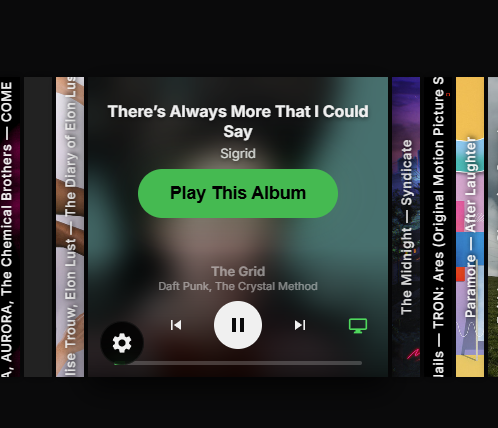

# CD Music Display

> ⚠️ **Disclaimer:** This project was entirely "vibe coded" by an AI agent (Google Antigravity). It is experimental!

> An ultra-wide, touch-first, self-hosted physical CD shelf UI for your Spotify library. Dockerised and designed specifically for long, wide hardware displays like a wall-mounted marquee.


## Features

- 🎵 **Spotify Integration**: Connect your entire Spotify library and control playback via the Spotify Web API.
- 📀 **Physical CD Rack UI**: Browse your albums as a continuous, swipeable rack of physical CD spines.
- 🎛️ **Glassmorphic Controls**: Tap any album to bring it front-and-center. A slick, auto-hiding glass overlay provides play controls and a global mini-player.
- 📱 **Spotify Connect Ready**: Pick which of your physical Spotify Connect devices (Sonos, Echo, Desktop) to play music out of directly from the UI.
- ⚙️ **On-Screen Settings**: A full-screen overlay for changing themes, sort orders, and managing API keys without needing an external app.
- 🖥️ **Ultra-Wide Optimised**: Custom engineered specifically for displays that are very wide but not very tall.
- 🐳 **Docker Deployment**: One-command setup.

## Screenshots



## Quick Start (Docker)

1. Clone the repository:
   ```bash
   git clone https://github.com/Adman1020/CD-Music-Display.git
   cd CD-Music-Display
   ```
2. Start the application using Docker Compose:
   ```bash
   docker compose up -d
   ```
3. Open [http://localhost:3000](http://localhost:3000) in your browser.
4. Follow the on-screen setup wizard to configure your Spotify credentials and log in.

## Spotify Developer Setup

Because this app acts as a remote control for your Spotify account, you must create a personal Spotify Developer App.

1. Go to the [Spotify Developer Dashboard](https://developer.spotify.com/dashboard) and log in.
2. Click on **Create app**.
3. Set your App name and App description to whatever you like.
4. Add the following **Redirect URI**: `http://127.0.0.1:3000/auth/callback` (or `http://localhost:3000/auth/callback` if testing locally, or your specific IP address if accessing over the network).
5. Ensure you check **Web API** and **Web Playback SDK** in the APIs/Permissions section.
6. Copy your **Client ID** and **Client Secret** and enter them into the app's setup screen in your browser.
7. **Note:** A Spotify Premium account is required for full playback control and Connect features.

## Architecture

- **Backend:** Express.js (Node.js) serving a REST API and managing Spotify OAuth securely.
- **Frontend:** Vanilla JavaScript, HTML5, and CSS3. Zero heavy frameworks.
- **Database:** SQLite (via `better-sqlite3`) to securely store your configuration, access tokens, and cached album art.
- **APIs:** Spotify Web API + Playback SDK

## License

This project is licensed under the [MIT License](LICENSE).
