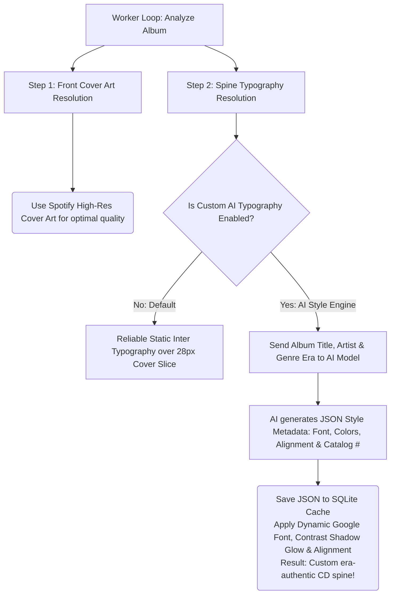

# CD Music Display

> ⚠️ **Disclaimer:** This project was entirely "vibe coded" by an AI agent (Google Antigravity). It is experimental!

> An ultra-wide, touch-first, self-hosted physical CD shelf UI for your Spotify library. Dockerised and designed specifically for long, wide hardware displays like a wall-mounted marquee.


## Features

- 🎵 **Spotify Integration**: Connect your entire Spotify library and control playback via the Spotify Web API.
- 📀 **Physical CD Rack UI**: Browse your albums as a continuous, swipeable rack of physical CD spines.
- 🎛️ **Glassmorphic Controls**: Tap any album to bring it front-and-center. A slick, auto-hiding glass overlay provides play controls and a global mini-player.
- 📱 **Spotify Connect Ready**: Pick which of your physical Spotify Connect devices (Sonos, Echo, Desktop) to play music out of directly from the UI.
- ⚙️ **On-Screen Settings**: A full-screen overlay for changing themes, sort orders, and managing API keys without needing an external app.
- 🖥️ **Ultra-Wide Optimised**: Custom engineered specifically for displays that are very wide but not very tall.
- 🐳 **Docker Deployment**: One-command setup.

## Screenshots


## Quick Start (Docker)

1. Clone the repository:
   ```bash
   git clone https://github.com/Adman1020/CD-Music-Display.git
   cd CD-Music-Display
   ```
2. Start the application using Docker Compose:
   ```bash
   docker compose up -d
   ```
3. Open [http://localhost:3000](http://localhost:3000) in your browser.
4. Follow the on-screen setup wizard to configure your Spotify credentials and log in.

## Spotify Developer Setup

Because this app acts as a remote control for your Spotify account, you must create a personal Spotify Developer App.

1. Go to the [Spotify Developer Dashboard](https://developer.spotify.com/dashboard) and log in.
2. Click on **Create app**.
3. Set your App name and App description to whatever you like.
4. Add the following **Redirect URI**: `http://127.0.0.1:3000/auth/callback` (or `http://localhost:3000/auth/callback` if testing locally, or your specific IP address if accessing over the network).
5. Ensure you check **Web API** and **Web Playback SDK** in the APIs/Permissions section.
6. Copy your **Client ID** and **Client Secret** and enter them into the app's setup screen in your browser.
7. **Note:** A Spotify Premium account is required for full playback control and Connect features.

## Architecture

- **Backend:** Express.js (Node.js) serving a REST API and managing Spotify OAuth securely.
- **Frontend:** Vanilla JavaScript, HTML5, and CSS3. Zero heavy frameworks.
- **Database:** SQLite (via `better-sqlite3`) to securely store your configuration, access tokens, and cached album art.
- **APIs:** Spotify Web API, Cover Art Archive, MusicBrainz, + AI Vision models (optional)

## Artwork Engine & AI Spine Typography System

To recreate the visual diversity and aesthetic charm of a physical CD collection without relying on expensive image generation, crowdsourced photos, or unreliable web scraping, the backend server features an intelligent **AI Spine Typography & Style Engine**.

### Pipeline Workflow Diagram



### Key Technical Details

#### 1. Intelligent AI Spine Typography Engine (Pure Text JSON)
* **Why avoid image diffusion or complex vector drawing?** Diffusion models (DALL-E 3, Imagen 3) are prohibitively expensive ($0.04 to $0.08 per image) and struggle with vertical typography on thin spines. Even generating full vector SVG files can consume excess tokens and result in rigid layouts.
* **The Solution:** Our engine prompts lightweight AI LLMs (Gemini, GPT, Claude) to function as elite graphic designers and music art historians. The AI analyzes the musical genre and release era to return compact **JSON style metadata** (~150 tokens) selecting:
  - **31 Curated Google Fonts & Randomized Shuffling:** From grunge/metal (`Creepster`, `Nosifer`, `Bungee Inline`) and synthwave (`Audiowide`, `Orbitron`) to jazz/classical (`Bodoni Moda`, `Playfair Display`) and bold pop (`Anton`, `Bebas Neue`, `Outfit`). The engine dynamically shuffles category order in every prompt and applies high creativity temperatures (`0.9`) to completely eliminate AI position bias and guarantee exciting variation across your collection!
  - **Dynamic Text Fitting & Overflow Protection:** The frontend monitor measures total artist and title character counts, automatically scaling font size down (from 12.5px down to 9.5px) and adjusting letter spacing so long titles fit snugly on narrow CD spines without ever falling off the ends.
  - **Optimal Vertical Text Positioning:** Dynamically aligns vertical text at the bottom (`start`), center (`center`), or top (`end`) of the spine to avoid artwork clutter and mirror real-world retail CD rack variation.
  - **Record Labels & Catalog Numbers:** Adds simulated or authentic catalog identification codes (e.g. `4AD-0012`, `CD-78219`) along the bottom edge of the case.

#### 2. Intelligent Readability & Contrast Protection
* Text overlays appear directly above a 28px vertical slice of the Spotify album cover artwork.
* The frontend automatically calculates the RGB relative luminance of the AI-selected text color:
  - **Bright Font Colors:** Automatically receive a deep, multi-layered jet-black shadow glow to stand out against white or vibrant background artwork.
  - **Dark Font Colors:** Receive a crisp white contrast halo glow to maintain razor-sharp legibility over dark cover slices.

#### 3. 4-Column Balanced & Scrollable Settings Modal
* **Ultra-Wide Optimization:** Distributes configuration menus, account controls, AI provider credentials, test batch buttons, and live diagnostic terminal logs across 4 perfectly proportioned side-by-side columns.
* **Vertical Scroll Protection:** Equipped with fluid overflow scrolling so menus and log panels remain fully accessible on any monitor resolution without items falling off the bottom of the screen.

#### 4. Zero-Risk AI Testing Mode, Unlocked Rate Limits & Static Fallback
* **AI Testing Mode:** Protects your API token budget by pausing continuous processing until you click **Process 5 Albums (Test Batch)** in Settings. Inspect your results before processing your entire library!
* **Unlocked Rate Limiting:** Processes your catalog strictly according to your configured API Rate Limit (requests/min), stripping out forced legacy delays so albums style as fast as your provider allows.
* **Static Fallback:** Whenever AI mode is turned off (or before an album is processed), the system automatically reverts to our bulletproof default: crisp, clean static `Inter` font text rendered instantly (50ms per album) over the standard jewel-case artwork slice.

---

## Ultra-Low Cost AI Model Recommendations

Because the AI Typography Engine generates compact JSON style definitions rather than imagery or heavy coordinates, it operates at lightning speed and costs virtually nothing (less than **$0.001 total** per 100 albums processed!):

1. **Google Gemini**
   - **`gemini-2.5-flash`** *(Recommended Workhorse)*: Exceptional graphic design reasoning, precise JSON formatting, and lightning speed with generous free-tier allowances on Google AI Studio.
   - **`gemini-3.0-flash-lite`**: Ultra-lightweight and extremely fast for processing massive record collections with negligible token costs.
2. **OpenAI**
   - **`gpt-4o-mini`** *(Recommended)*: Incredible typography matching and genre understanding at under $0.0001 per album.
3. **Anthropic Claude**
   - **`claude-3-5-haiku-20241022`** *(Recommended)*: Superb high-speed creative typography styling (&lt;$0.0002 per album).
   - **`claude-3-5-sonnet-20240620`**: Unrivaled artistic taste and aesthetic variation for true connoisseurs.

## License

This project is licensed under the [MIT License](LICENSE).
